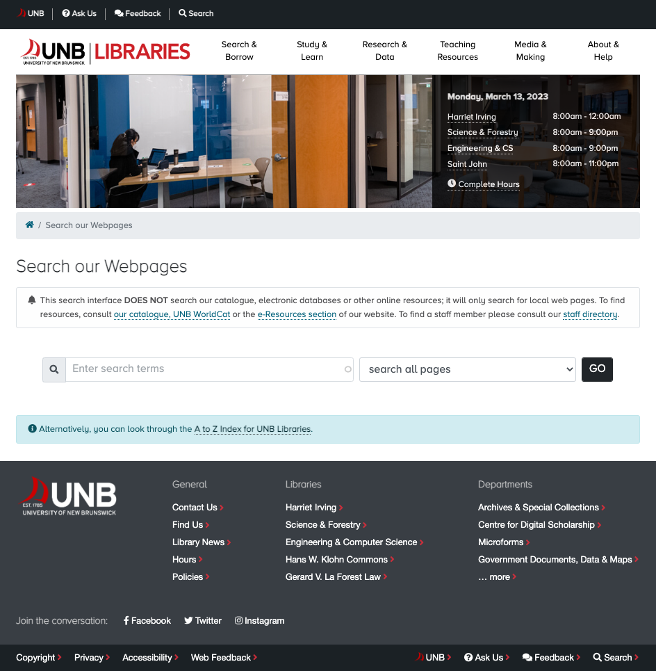

# UNB Libraries Theme.
Drupal 8 and 9 theme based on Bootstrap Barrio 5.1.x theme (https://www.drupal.org/project/bootstrap_barrio). 
Note the theme branch <kbd>9.x</kbd> segment refers to Drupal 9.x while the <kbd>4.x</kbd> segment refers
to Bootstrap 4. The <kbd>dev-8.x-4.x</kbd> branch is intended to use for projects using Drupal 8.x.

## License
- unb_lib_theme is licensed under the MIT License:
  - http://opensource.org/licenses/mit-license.html

- Attribution is not required, but much appreciated:
  - `unb_lib_theme by UNB Libraries`

## How to Use
This theme is not intended to be used directly but instead as a **parent theme** that provides UNB Libraries-branded
header/footer/assets etc. for a project's subtheme. Requirements/dependencies are as follows:

- add `Bootstrap Barrio`, `UNB Libraries Calendar Hours Client` and `UNB Libraries Banner Alerts`, along with `UNB Libraries theme`
  to your project repo <kbd>build/composer.json</kbd> file's require section:
  <pre><code>"require": {
    &hellip;
    "drupal/bootstrap_barrio": "5.1.10",
    "unb-libraries/alert_scheduler": "dev-8.x-1.x",
    "unb-libraries/calendar_hours": "dev-9.x-1.x",
    "unb-libraries/unb_lib_theme": "dev-9.x-4.x",
    &hellip;
  }</code></pre>

  The <i>emergency banner</i> and <i>banner image library hours</i> sections of the default page
  template header section depend on UNB Libraries' <i>Alert Scheduler</i> and <i>Calendar Hours Client</i> 
  projects respectively to function as intended.  
  For more information visit https://github.com/unb-libraries/alert-scheduler and https://github.com/unb-libraries/calendar_hours
    

- add `Twitter Bootstrap` <kbd>4.5.x</kbd> to your **project repo's** root `composer.json` file's `require-dev` section. This will provide
  the SASS code necessary (within the `vendor` folder) for your subtheme dev environment for extending/overriding Bootstrap
  variables/functions/etc. Example:
  <pre><code>"require": {
    &hellip;
    "twbs/bootstrap": "~4.5.3",
    &hellip;
  }</code></pre>

Note that the <kbd>4.5.3</kbd> branch was selected to match the version used by Bootstrap Barrio 5.1.x.

## UNB Libraries Administration Theme Enhancements
This theme contains various stylistic improvements to Drupal core's `Seven` administration
theme defined in the <code>src/scss/admin-overrides-seven.scss</code> Sass file. These style
rules are primary intended for UNB Libraries projects. Should you use `Seven` as your
project's administration theme and want to incorporate these overrides please proceed as follows:
- create an <code>admin-style.scss</code> files inside your subtheme's <code>src/scss</code> folder
- add the following import at the top of this file:
  <pre><code>@import '../../../../../vendor/unb-libraries/unb_lib_theme/src/scss/admin-overrides-seven.scss';</code></pre>
- define a library for the administration styles in your subtheme's <code>SUBTHEMENAME.libraries.yml</code> file:
  <pre><code>admin-styling:
    version: VERSION
    css:
      theme:
        dist/css/admin-style.css: { minified: true }
  </code></pre>
- finally, you may attach the admin library assets to an administration form in code using:
<code>$form['#attached']['library'][] = 'lib_unb_ca/admin-styling';</code>

This will compile (minimized) to <code>dist/css/admin-style.css</code>. If you wish to add additional project-specific
administration rules simply add them **after** your <code>@import</code> line.

### Utility Classes
Several utility classes are available for use for your convenience <kbd>(see src/scss/custom/_utility.scss)</kbd>:

- <i>Hover Grow</i>
  - To transitionally scale an element by 3% on hover/focus, apply <code>hover-grow</code> class to the element 
    Example: <code>&lt;div class="card bg-light border border-unb-red hover-grow text-center"&gt;</code> 
    See: https://lib.unb.ca/copyright
  - To transitionally scale an element <b>horizontally</b> (i.e. width) by 3% on hover/focus, apply <code>hover-grow-h</code> class to the element 
    Example: <code>&lt;div class="card bg-light border border-unb-red hover-grow-h text-center"&gt;</code>
  - To transitionally scale an element <b>vertically</b> (i.e. height) by 3% on hover/focus, apply <code>hover-grow-v</code> class to the element 
    Example: <code>&lt;div class="card bg-light border border-unb-red hover-grow-v text-center"&gt;</code><
- <i>Expanded/Collapsed Icons</i>
  - To add a Font Awesome square caret (i.e. upward/downward-facing arrow) icon to the left of toggle buttons to
  indicate expandable/collapsible sections simply apply a <kbd>header-icon-h</kbd> class to the parent element of
  the buttons.

     Example: <code>&lt;div class="accordion header-icon-h" id="accordion-example"&gt;</code> 

     Note this feature relies on the <b>aria-expanded</b> attribute - for info on Bootstrap buttons + aria see:
     https://getbootstrap.com/docs/4.6/components/collapse/#accordion-example)  

## Style Guide Suggestions
### Webforms
- UNB Libraries forms adopt a standardized look and feel for attributes such as background, border, button colors, etc - 
  this is done by wrapping the form field (including form action buttons)) inside a container with a
  <code>theme-dark</code> class applied to it:
    

- <b>Note:</b> to implement this using Webform UI, add a parent <i>Container</i> element, edit it, switch to the
  <i>Advanced</i> tab and expand the <i>Element Attributes</i> section. Next, choose the <i>custom</i> element
  CSS class and enter <kbd>theme-dark</kbd> in the conditional field. Finally, save the change.

    

- The <b>Privacy</b> footer is used across most webforms and is implemented using a Bootstrap alert:
  <pre><code>&lt;div class="alert alert-info" role="alert"&gt;
    &lt;strong&gt;Privacy: </strong> UNB Libraries will only use the comments you send to
    improve our website and services. We are not storing any personal information.
  &lt;/div&gt;
  </code></pre>

## Notes
- This subtheme uses Bootstrap Barrio as a base theme, specifically the 5.1.x branch which, in turn, employs Bootstrap 4 (Barrio 5.5.x uses Bootstrap v5):
  - https://www.drupal.org/project/bootstrap_barrio

- As of Bootstrap Barrio v5.1.10, Bootstrap v4.5.x is specifically bundled (i.e. do not use v4.6.x - see global-styling theme library)
  - Subthemes compiling sass should add the following `require-dev` package to `composer.jason`:  
    "twbs/bootstrap": "~4.5.3",

  - The banner hours depends on the UNB Libraries > Calendar Hours > Calendar Hours Client module:
    - https://github.com/unb-libraries/calendar_hours

  - Add Font Awesome Icons module, 2.x branch for icons used in Header/Footer:
    - https://www.drupal.org/project/fontawesome
    - load only the <b>free</b> icon subset, i.e. the <b>Solid</b> and <b>Brand</b> icons <i>(else the non-free icon font
      may take precedence and not display)</i>
       - this in done via the Font Awesome Settings > Partial File Configuration admin config form: 
         <kbd>/admin/config/content/fontawesome</kbd>
